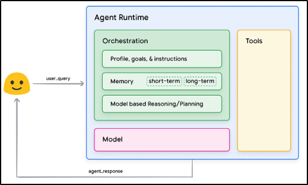
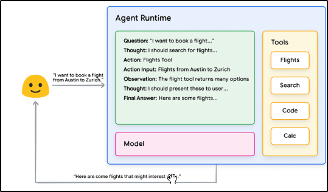
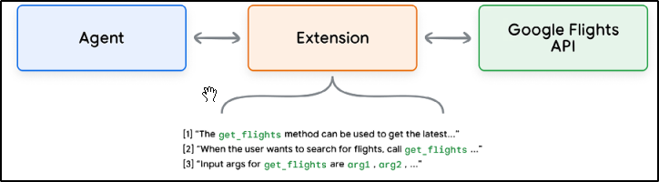
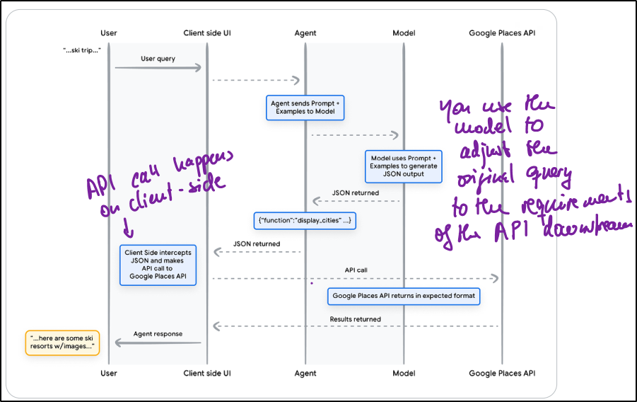

# Agents

- [Agents](#agents)
  - [Introduction - Definition](#introduction---definition)
  - [Agent architecture and components](#agent-architecture-and-components)
    - [Model](#model)
    - [Tools](#tools)
    - [Orchestration layer](#orchestration-layer)
  - [Key differences model and agent](#key-differences-model-and-agent)
  - [More details on orchestration layer](#more-details-on-orchestration-layer)
    - [Reasoning techniques](#reasoning-techniques)
      - [ReAct (Reason and Action)](#react-reason-and-action)
      - [Chain-of-Thought (CoT)](#chain-of-thought-cot)
      - [Tree-of-Thoughts (ToT)](#tree-of-thoughts-tot)
  - [More details on tools](#more-details-on-tools)
    - [Extensions](#extensions)
    - [Functions](#functions)
      - [Difference extension and functions](#difference-extension-and-functions)
    - [Data Storages](#data-storages)
  - [Targeted learning](#targeted-learning)
    - [In-context learning](#in-context-learning)
    - [Retrieval-based in-context learning](#retrieval-based-in-context-learning)
    - [Fine-tuning based learning](#fine-tuning-based-learning)

## Introduction - Definition

- Agent = autonomous application
- Agent:
  - Extends the standalone capabilities of a Gen AI model
  - Gives model access to real-time information or allows real-world action
  - Offers reasoning, logic and access to external information to the model

## Agent architecture and components

<h6 style="text-align: center"><strong>Agent architecture and components. Source: Google.</strong></h6>

### Model

- Model = LLM
- Centralized decision-maker (like the brain in a body)
- Can be of any type: general purpose, multimodal or fine-tuned &rarr; BUT should fit the application and the purpose

### Tools

- Bridge the gap to the real world &rarr; Allow the agent to interact with external services

### Orchestration layer

- Describes a cyclical process how agent takes information, does some reasoning, performs some action or decision
- Loop continues until goal is reached

## Key differences model and agent

- Model is limited to training data knowledge
- Agent has extended knowledge through external information (accessed via tools)
- Model has no memory (no chat history) &rarr; moves from query to query
- Agent can remember previous queries/ decisions

## More details on orchestration layer

### Reasoning techniques

- Needed in orchestration layer such that agent can process information, make reasoning and decision and define actions

#### ReAct (Reason and Action)

- Prompt engineering framework
- Strategy to reason and take action based on user query

<h6 style="text-align: center"><strong>Example of ReAct as reasoning technique for agent. Source: Google.</strong></h6>

#### Chain-of-Thought (CoT)

- Prompt engineering framework
- Reasoning through intermediate steps

#### Tree-of-Thoughts (ToT)

- Prompt engineering framework
- Allows model to explore various thought chains (&rarr; exploration and even lookahead)

## More details on tools

- Can be various things: Extensions, Functions, Data Storages or Plugins
- Tools = Gate to outside world

### Extensions

- Extensions = bridge gap between API and an agent in a standardized way
- How?
  - Teaches the agent how to use the API using examples
  - Teaches the agent what arguments are accepted by API for successful retrieval
- Different extensions for different tasks
  - Agent uses model and examples to choose the right extension for the task
  - Examples: Flights API, Maps API, Weather API

<h6 style="text-align: center"><strong>Example of how extensions work. Source: Google.</strong></h6>

### Functions

- Gives the developer more control over the data flow (as the API call is made later on client-side)

#### Difference extension and functions

- No API call &rarr; Model outputs function and its arguments but does not make a API call
- Functions are executed on client-side (e.g. in the application)
- Extensions are executed on agent-side

<h6 style="text-align: center"><strong>Example of how functions work. Source: Google.</strong></h6>

### Data Storages

- Drawback of just having a model:
  - Knowledge base of the model is the training data &rarr; static, i.e. does not update if real-world changes (unless retrained)
- Solution: Data storages
  - Give access to dynamic and up-to-date information
  - Data storages convert incoming data (can be anything: documents, tables, websites) into vector database embeddings
- Execution of data storages &rarr; agent-side 

## Targeted learning

- Way to improve the model performance
- Different strategies: In-context learning, Retrieval-based in-context learning, fine-tuning based learning

### In-context learning

- Provide generalized model with prompt, tools and few examples
- Learn on the fly
- Example: ReAct framework
- Analogy: Chef gets a recipe (prompt), some ingredients (tools), and some example pictures and prepares the dish on the fly matching consumer preferences

### Retrieval-based in-context learning

- Offering relevant information, tools and examples from external memory
- Example: Example store in Vertex AI or data stores RAG
- Analogy: Chef has access to many cookbooks and ingredients &rarr; Dynamically choose ingredients and cookbooks to align with consumer preferences

### Fine-tuning based learning

- Train the model on dataset with examples for specific task
- Analogy: Sending chef back to culinary school
